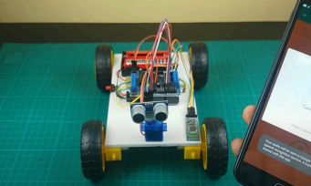

# A-MIMIR: Autonomous Smart Seeker Robot

**A-MIMIR** (*Autonomous Smart Seeker Robot for Item Retrieval*) is an Arduino-based autonomous robotic platform designed for item retrieval, light-level awareness, and intelligent obstacle navigation.

---

## 🛠️ Hardware Specifications & Pin Mapping

### Components Used
* **Microcontroller:** Arduino Uno
* **Motor Shield:** Adafruit Motor Shield v1 (L293D)
* **Motors:** 4 × DC Motors
* **Actuators:** 1 × Servo Motor
* **Sensors:** 
  * HC-SR04 Ultrasonic Distance Sensor
  * LDR (Light Dependent Resistor) Sensor Module
* **Indicators:** 2 × LEDs

### Pin Connections

| Component | Pin | Description |
| :--- | :--- | :--- |
| **Servo Motor** | Pin 10 | Servo sweep mechanism |
| **Ultrasonic Trigger** | Analog Pin `A0` | HC-SR04 Trigger Pin |
| **Ultrasonic Echo** | Analog Pin `A1` | HC-SR04 Echo Pin |
| **LDR Sensor** | Analog Pin `A2` | Ambient light measurement |
| **LED 1** | Digital Pin `7` | Light status indicator 1 |
| **LED 2** | Digital Pin `2` | Light status indicator 2 |
| **DC Motors 1–4** | Motor Shield Channels 1, 2, 3, 4 | 4-Wheel Drive Control |

---

## 💻 Software & Dependencies

Make sure you have installed the following libraries in your Arduino IDE before uploading:

* **`Servo.h`** *(Built-in)*
* **`NewPing.h`** *(For ultrasonic distance reading)*
* **`AFMotor.h`** *(Adafruit Motor Shield library)*

---

## 🚀 Key Features

* **Ambient Light Sensing:**
  * Monitors light intensity using an LDR sensor connected to `A2`.
  * **Bright Light Mode ($\ge 700$):** Blinks `LED 1` and `LED 2` alternately (turn-signal effect).
  * **Low Light Mode ($< 700$):** Keeps both LEDs constantly illuminated.
* **4WD Movement Control:** Built-in modular control functions for basic movement (`maju`, `mundur`, `kanan`, `kiri`, `berhenti`).
* **Ultrasonic Scanning Routine:** Includes `scanning()` and `servoSweep()` helper functions designed to rotate the ultrasonic sensor on a servo for multi-angle obstacle detection.

---

## ⚡ How to Run

1. Connect the components according to the pin configuration table above.
2. Open the project sketch file in the **Arduino IDE**.
3. Install the missing libraries (`NewPing` and `Adafruit Motor Shield library`) via **Tools > Manage Libraries...**
4. Select board **Arduino Uno** and your corresponding COM Port.
5. Upload the sketch to your board.
6. Open the **Serial Monitor** at **9600 baud** to view real-time LDR values.

---

## 📷 Robot Overview

  
  
<i>Physical design illustration of A-MIMIR. (Original built model broke long ago 🥀)</i>

